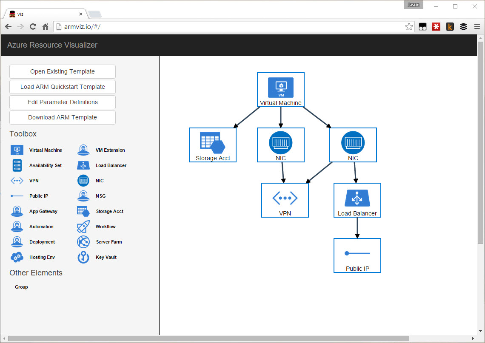

# Azure Resource Visualizer

Azure provides an amazing feature called the Azure Resource Manager. The idea is that you create a JSON document that represents the resources and the relationships. You then call an API in Azure with that desired configuration, and it makes it happen.

You're Captain Picard of the USS Azure.

JSON is amazing, and not just because we share a name. However, I think visually (think: Visio). Since JSON is easy to work with in JavaScript, and we have a variety of diagramming libraries, let's clean this up!

## Status

This code is terrible. Really terrible actually. It's pretty embarrassing, and is just meant as a proof of concept. I was obsessed with seeing this work that I ignored everything I have ever learned.

The sample JSON is actually pasted into the code, so you'll need to scroll down to the bottom to see what I'm doing. Basically, I iterate the resources and create nodes, and then I iterate the dependencies to determine the relationships.

## Future

* Still trying to figure out if there is a better way to read and understand the dependencies. There is a custom syntax in there.
* There should be no reason why you can't edit a node by clicking on it. Also no reason why you couldn't get the modified JSON back out.

## Installation

	npm install
	npm install -g gulp bower tsd typescript mocha chai
	bower install
	tsd install

## Running

Build the website to serve it locally:

	gulp serve

### Troubleshooting

**Problem:** Old Typescript version installed. (use `tsc-v` to check)
**Solution:** Delete TypeScript from the `C:\Program Files (x86)\Microsoft SDKs\TypeScript`

## License

Microsoft Developer Experience & Evangelism

Copyright (c) Microsoft Corporation. All rights reserved.

THIS CODE AND INFORMATION ARE PROVIDED "AS IS" WITHOUT WARRANTY OF ANY KIND, EITHER EXPRESSED OR IMPLIED, INCLUDING BUT NOT LIMITED TO THE IMPLIED WARRANTIES OF MERCHANTABILITY AND/OR FITNESS FOR A PARTICULAR PURPOSE.

The example companies, organizations, products, domain names, e-mail addresses, logos, people, places, and events depicted herein are fictitious. No association with any real company, organization, product, domain name, email address, logo, person, places, or events is intended or should be inferred.